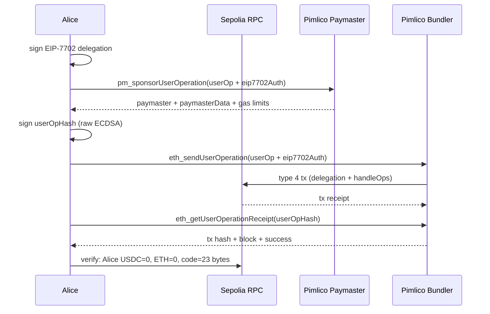

# Python E2E Tests

[🇨🇳 中文版](README_zh.md)

Pure Python E2E test suite for the EIP-7702 Minimal Batch Executor. No CLI tools required (no `cast`, no `forge` at runtime). Uses EntryPoint v0.7.

## Prerequisites

- Python 3.12+
- [uv](https://docs.astral.sh/uv/) (package manager)
- `.env` file with required keys (see [Environment Variables](#environment-variables))

## Quick Start

```bash
cd script/python
uv run e2e_pimlico.py
```

`uv run` automatically creates `.venv` and installs dependencies on first run.

## Environment Variables

Create a `.env` file in the **project root directory** (same level as `foundry.toml`). See [`.env.example`](../../.env.example) for a template:

```env
RPC_URL=https://eth-sepolia.g.alchemy.com/v2/<your-key>
DEPLOYER_PRIVATE_KEY=0x...
SPONSOR_PRIVATE_KEY=0x...
PIMLICO_API_KEY=pim_...
```

| Variable | Description |
|----------|-------------|
| `RPC_URL` | Ethereum Sepolia RPC endpoint |
| `DEPLOYER_PRIVATE_KEY` | Deploys MinimalAccount contract |
| `SPONSOR_PRIVATE_KEY` | Transfers USDC to Alice |
| `PIMLICO_API_KEY` | Pimlico bundler + paymaster API key |

## Architecture

```
script/python/
├── e2e_pimlico.py           # E2E #3 orchestrator (async)
├── config.py                # Chain constants (EP address, USDC)
├── tx.py                    # Transaction dataclass (typed tx params)
├── hash.py                  # Pure hash functions (delegation, UserOp v0.7)
├── artifacts/               # Pre-compiled contract artifacts & ABI definitions
│   ├── __init__.py          # load_artifact(), USDC_ABI, EP_ABI
│   └── MinimalAccount.json  # Deploy bytecode (update after forge build)
│
├── signers/                 # Signer abstraction
│   ├── base.py              # Signer ABC: sign_hash(bytes32) → (v, r, s)
│   └── local/
│       └── signer.py        # LocalSigner — in-memory private key
│
├── providers/               # Bundler & Paymaster abstraction
│   ├── errors.py            # ProviderError
│   ├── types.py             # GasPrice, UserOpReceipt, SponsorResult
│   ├── bundler.py           # Bundler ABC
│   ├── paymaster.py         # Paymaster ABC
│   └── pimlico/             # Pimlico implementation
│       ├── base.py          # JsonRpcMixin (async JSON-RPC)
│       ├── bundler.py       # PimlicoBundler
│       └── paymaster.py     # PimlicoPaymaster
│
└── pyproject.toml           # Dependencies (managed by uv)
```

## Design Principles

### Signer Abstraction

The `Signer` interface provides two signing primitives: `sign_hash()` for off-chain 32-byte hashes (delegation, UserOp) and `sign_transaction()` for on-chain Ethereum transactions. All hash computation lives in `hash.py`.

```python
from signers.local import LocalSigner

signer = LocalSigner.random()          # fresh keypair
v, r, s = signer.sign_hash(hash_bytes) # raw ECDSA, no EIP-191 prefix
```

This design enables future signer implementations without changing any hash logic:

| Signer | Description | Status |
|--------|-------------|--------|
| `LocalSigner` | In-memory private key | ✅ Implemented |
| `HardwareSigner` | Hardware wallet (Ledger, Trezor) | Planned |
| `KMSSigner` | Cloud KMS (AWS, GCP) | Planned |

### Provider Abstraction

Bundler and Paymaster are independent interfaces. Swap providers without changing E2E logic:

```python
from providers.pimlico import PimlicoBundler, PimlicoPaymaster

# Current
bundler = PimlicoBundler(url, entry_point)
paymaster = PimlicoPaymaster(url, entry_point)

# Future: mix and match
# bundler = AlchemyBundler(url, entry_point)
# paymaster = StackupPaymaster(url, entry_point)
```

### Async-First

All I/O operations (RPC calls, bundler API) use `async/await` with `aiohttp` and `AsyncWeb3`. CPU-bound operations (signing, hashing) remain synchronous.

## E2E Flow (6 Steps)

```
[1] Deploy MinimalAccount (Deployer)
[2] Sponsor transfers 1 USDC to Alice (Sponsor)
[3] Build UserOp + EIP-7702 delegation + request Pimlico sponsorship
[4] Alice signs UserOp off-chain (0 gas, 0 ETH)
[5] Submit UserOp via Pimlico bundler (with eip7702Auth)
[6] Wait for receipt + verify assertions
```

**Three actors:**

| Actor | Role | ETH | Signs |
|-------|------|-----|-------|
| Deployer | Deploys MinimalAccount | Pays gas | Deploy tx |
| Sponsor | Funds Alice with USDC | Pays gas | Transfer tx |
| Alice | Executes batch via ERC-4337 | **0 ETH** | Delegation + UserOp (off-chain) |

**USDC round-trip:** Sponsor → Alice → Sponsor (1 USDC, split 0.6 + 0.4 batch)

### Sequence Diagram



### Step 3 — Delegation + Build UserOp + Sponsorship

1. **Alice signs EIP-7702 delegation** (off-chain) — `keccak256(0x05 || rlp(chainId, implAddress, nonce))`, produces `(yParity, r, s)` authorization tuple. Independent of UserOp content.
2. **Build callData** — Encode ERC-7821 `execute(BATCH_MODE, encodedBatch)` with two USDC transfers (0.6 + 0.4) back to Sponsor
3. **Assemble UserOp** — Unpacked format: sender, nonce, callData, gas fields (zeros for now), dummy signature, plus `eip7702Auth` parameter
4. **Request Pimlico sponsorship** — Call `pm_sponsorUserOperation`; Pimlico simulates and returns: paymaster address, `paymasterData` (signature), gas limits (verification/call/preVerification/paymaster)
5. **Merge sponsored fields** into UserOp — Pimlico's gas limits and paymaster data replace the zero placeholders

### Step 4 — Alice Signs UserOp

1. **Pack gas fields** — `accountGasLimits` = verificationGas(128bit) || callGas(128bit), `gasFees` = maxPriority(128bit) || maxFee(128bit), `paymasterAndData` = address(20) + pmVerGas(16) + pmPostGas(16) + pmData
2. **Compute userOpHash** (v0.7 packed keccak) — `packHash = keccak256(abi.encode(sender, nonce, keccak(initCode), keccak(callData), accountGasLimits, preVerGas, gasFees, keccak(paymasterAndData)))`, then `userOpHash = keccak256(abi.encode(packHash, entryPoint, chainId))`
3. **Alice signs** the 32-byte `userOpHash` with raw ECDSA (no EIP-191 prefix) → 65-byte signature `r(32) + s(32) + v(1)`

### Step 5 — Submit via Pimlico Bundler

1. **Attach signature** to UserOp, replacing the dummy
2. **Call `eth_sendUserOperation`** with the complete UserOp + `eip7702Auth` — Pimlico's bundler wraps it in a type 4 (EIP-7702) transaction carrying Alice's delegation in `authorizationList`
3. **Atomic execution** — EVM processes authorization list first (sets `Alice.code = 0xef0100 || implAddress`), then executes `handleOps` through EntryPoint → Alice's delegated MinimalAccount logic → USDC batch transfers
