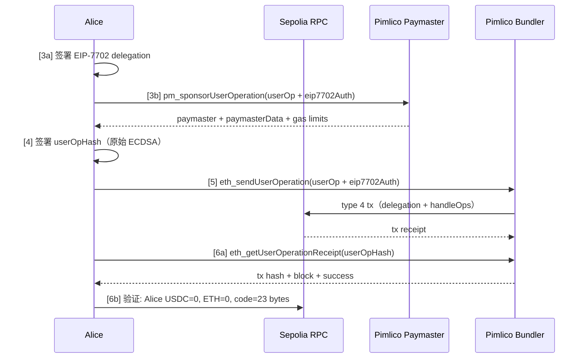

# Python E2E 测试

[🇬🇧 English](README.md)

EIP-7702 Minimal Batch Executor 的纯 Python E2E 测试套件。运行时无需 CLI 工具（不依赖 `cast`、`forge`）。使用 EntryPoint v0.7。

## 前置要求

- Python 3.12+
- [uv](https://docs.astral.sh/uv/)（包管理器）
- `.env` 配置文件（见[环境变量](#环境变量)）

## 快速开始

```bash
cd script/python
uv run e2e_pimlico.py
```

`uv run` 首次运行时自动创建 `.venv` 并安装依赖。

## 环境变量

在**项目根目录**（与 `foundry.toml` 同级）创建 `.env` 文件。参考 [`.env.example`](../../.env.example) 模板：

```env
RPC_URL=https://eth-sepolia.g.alchemy.com/v2/<your-key>
DEPLOYER_PRIVATE_KEY=0x...
SPONSOR_PRIVATE_KEY=0x...
PIMLICO_API_KEY=pim_...
```

| 变量 | 说明 |
|------|------|
| `RPC_URL` | Ethereum Sepolia RPC 端点 |
| `DEPLOYER_PRIVATE_KEY` | 部署 MinimalAccount 合约 |
| `SPONSOR_PRIVATE_KEY` | 向 Alice 转 USDC |
| `PIMLICO_API_KEY` | Pimlico bundler + paymaster API 密钥 |

## 架构

```
script/python/
├── e2e_pimlico.py           # E2E #3 主入口（异步）
├── config.py                # 链常量（EP 地址、USDC）
├── tx.py                    # Transaction 数据类（类型化交易参数）
├── hash.py                  # 纯哈希函数（delegation、UserOp v0.7）
├── artifacts/               # 预编译合约产物与 ABI 定义
│   ├── __init__.py          # load_artifact(), USDC_ABI, EP_ABI
│   └── MinimalAccount.json  # 部署字节码（forge build 后更新）
│
├── signers/                 # 签名者抽象
│   ├── base.py              # Signer ABC: sign_hash(bytes32) → (v, r, s)
│   └── local/
│       └── signer.py        # LocalSigner — 内存私钥
│
├── providers/               # Bundler 与 Paymaster 抽象
│   ├── errors.py            # ProviderError
│   ├── types.py             # GasPrice, UserOpReceipt, SponsorResult
│   ├── bundler.py           # Bundler ABC
│   ├── paymaster.py         # Paymaster ABC
│   └── pimlico/             # Pimlico 实现
│       ├── base.py          # JsonRpcMixin（异步 JSON-RPC）
│       ├── bundler.py       # PimlicoBundler
│       └── paymaster.py     # PimlicoPaymaster
│
└── pyproject.toml           # 依赖（由 uv 管理）
```

## 设计原则

### 签名者抽象

`Signer` 接口提供两个签名原语：`sign_hash()` 用于链下 32 字节哈希（delegation、UserOp），`sign_transaction()` 用于链上以太坊交易。所有哈希计算在 `hash.py` 中完成。

```python
from signers.local import LocalSigner

signer = LocalSigner.random()          # 生成新密钥对
v, r, s = signer.sign_hash(hash_bytes) # 原始 ECDSA，无 EIP-191 前缀
```

这种设计使新增签名者实现无需修改任何哈希逻辑：

| 签名者 | 说明 | 状态 |
|--------|------|------|
| `LocalSigner` | 内存私钥 | ✅ 已实现 |
| `HardwareSigner` | 硬件钱包（Ledger、Trezor） | 计划中 |
| `KMSSigner` | 云 KMS（AWS、GCP） | 计划中 |

### Provider 抽象

Bundler 和 Paymaster 是独立接口，切换 provider 无需修改 E2E 逻辑：

```python
from providers.pimlico import PimlicoBundler, PimlicoPaymaster

# 当前
bundler = PimlicoBundler(url, entry_point)
paymaster = PimlicoPaymaster(url, entry_point)

# 未来：自由组合
# bundler = AlchemyBundler(url, entry_point)
# paymaster = StackupPaymaster(url, entry_point)
```

### 异步优先

所有 I/O 操作（RPC 调用、bundler API）使用 `async/await`，基于 `aiohttp` 和 `AsyncWeb3`。CPU 密集操作（签名、哈希）保持同步。

## E2E 流程（6 步）

```
[1]  部署 MinimalAccount（Deployer）
[2]  Sponsor 向 Alice 转 1 USDC（Sponsor）
[3a] Alice 签署 EIP-7702 delegation（链下）
[3b] 构建 UserOp + 请求 Pimlico 赞助
[4]  Alice 签署 UserOp（链下，0 gas）
[5]  通过 Pimlico bundler 提交 UserOp（附带 eip7702Auth）
[6a] 从 bundler 获取回执
[6b] 验证链上状态
```

**三个角色：**

| 角色 | 职责 | ETH | 签名内容 |
|------|------|-----|----------|
| Deployer | 部署 MinimalAccount | 支付 gas | 部署交易 |
| Sponsor | 为 Alice 提供 USDC | 支付 gas | 转账交易 |
| Alice | 通过 ERC-4337 执行批量操作 | **0 ETH** | Delegation + UserOp（链下） |

**USDC 往返：** Sponsor → Alice → Sponsor（1 USDC，拆分为 0.6 + 0.4 批量转账）

### 时序图



### [3a] Alice 签署 EIP-7702 Delegation

Alice 链下签署委托授权。与 UserOp 内容无关，仅依赖 `(chainId, implAddress, txNonce)`。

- **哈希：** `keccak256(0x05 || rlp(chainId, implAddress, nonce))`
- **签名：** 原始 ECDSA → `(yParity, r, s)` 授权元组
- **产出：** `eip7702Auth` JSON 对象，用于 bundler API

### [3b] 构建 UserOp + 请求 Pimlico 赞助

1. **构建 callData** — 编码 ERC-7821 `execute(BATCH_MODE, encodedBatch)`，包含两笔 USDC 转账（0.6 + 0.4）转回 Sponsor
2. **组装 UserOp** — unpacked 格式：sender、nonce、callData、gas 字段（暂为零）、dummy 签名，加上 `eip7702Auth`
3. **调用 `pm_sponsorUserOperation`** — Pimlico 模拟后返回：paymaster 地址、`paymasterData`（签名）、gas 限制（verification/call/preVerification/paymaster）
4. **合并赞助字段**到 UserOp — Pimlico 的 gas 限制和 paymaster 数据替换零值占位符

### [4] Alice 签署 UserOp

1. **打包 gas 字段** — `accountGasLimits` = verificationGas(128bit) || callGas(128bit)，`gasFees` = maxPriority(128bit) || maxFee(128bit)，`paymasterAndData` = address(20) + pmVerGas(16) + pmPostGas(16) + pmData
2. **计算 userOpHash**（v0.7 packed keccak）— `packHash = keccak256(abi.encode(sender, nonce, keccak(initCode), keccak(callData), accountGasLimits, preVerGas, gasFees, keccak(paymasterAndData)))`，然后 `userOpHash = keccak256(abi.encode(packHash, entryPoint, chainId))`
3. **Alice 签名** 32 字节 `userOpHash`，使用原始 ECDSA（无 EIP-191 前缀）→ 65 字节签名 `r(32) + s(32) + v(1)`

### [5] 通过 Pimlico Bundler 提交

1. **附加签名**到 UserOp，替换 dummy 签名
2. **调用 `eth_sendUserOperation`**，携带完整 UserOp + `eip7702Auth` — Pimlico bundler 将其包装为 type 4（EIP-7702）交易，在 `authorizationList` 中携带 Alice 的 delegation
3. **原子执行** — EVM 先处理 authorization list（设置 `Alice.code = 0xef0100 || implAddress`），再执行 `handleOps`：EntryPoint → Alice 委托的 MinimalAccount 逻辑 → USDC 批量转账

### [6a] 等待回执

- **轮询 `eth_getUserOperationReceipt(userOpHash)`**，每 3 秒一次（最长 120 秒超时）
- **返回：** 交易哈希、区块号、成功状态

### [6b] 验证链上状态

- Alice USDC 余额 = 0（全部转回 Sponsor）
- Alice ETH 余额 = 0（从未持有）
- Alice code = 23 字节（`0xef0100 || implAddress` — EIP-7702 委托生效）
